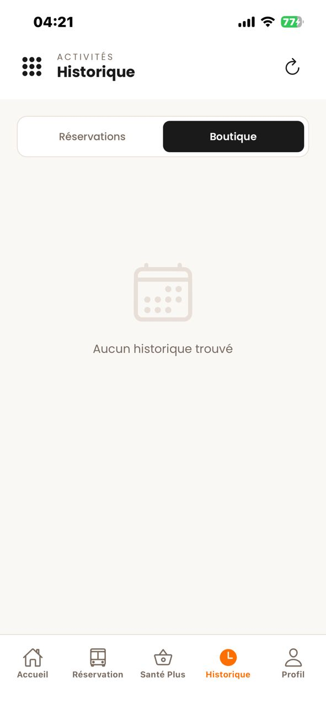

# 🚍 Nonvi Voyage Plus - La Révolution du Transport au Bénin

**Nonvi Voyage Plus** est une plateforme digitale complète dédiée à la modernisation du transport de voyageurs. Elle offre une synergie parfaite entre une application mobile intuitive pour les passagers et un puissant panel d'administration pour la supervision globale.

---

## 📱 Expérience Mobile (Passagers & Agents)

L'application mobile permet une réservation fluide, un suivi des trajets et une validation instantanée des billets.

````carousel

<!-- slide -->

<!-- slide -->

<!-- slide -->

<!-- slide -->

````

---

## ⚙️ Administration & Supervision (Pannel Admin)

Le système dispose d'une interface de gestion robuste permettant de piloter l'intégralité de l'activité transport.

````carousel

<!-- slide -->

<!-- slide -->

<!-- slide -->

<!-- slide -->

````

---

## ✨ Fonctionnalités Maîtresses

*   **🎫 Billetterie Digitale** : Réservation et achat de billets en ligne avec QR Code unique.
*   **💳 Paiement Intégré** : Support des solutions de paiement locales et internationales.
*   **🛡️ Gestion des Permissions** : Système de rôles granulaires pour les agents, chauffeurs et administrateurs.
*   **📊 Monitoring en Temps Réel** : Suivi des réservations et des revenus via le panel de supervision.
*   **⏰ Horaires & Tarifs Dynamiques** : Mise à jour instantanée des prix et des trajets depuis l'admin.

---

## 🛠️ Stack Technologique

*   **Backend** : Laravel 11 / API RESTful.
*   **Mobile** : React Native & Expo (iOS/Android).
*   **DevOps** : Scanner de QR Code intégré et notifications SMS/WhatsApp via Twilio.

---

## 📄 Licence
Ce projet est sous licence MIT. Développé par **BELLOX**.
